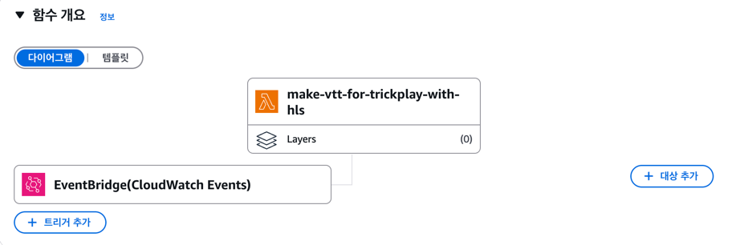

### eventBridge 트리거
- 이벤트 버스: default
이벤트 패턴:
```json
{
    "source": [
      "aws.mediaconvert"
    ],
    "detail-type": [
      "MediaConvert Job State Change"
    ],
    "detail": {
      "status": [
        "COMPLETE"
      ]
    }
}
```

### 람다 함수 코드(index.mjs만 표시)
```js
import { S3Client, GetObjectCommand, PutObjectCommand } from "@aws-sdk/client-s3";
import { extractManifestPath } from "./extractManifestPath.mjs";
import { parseManifest } from "./parseManifest.mjs";
import { generateVTT } from "./generateVTT.mjs";

const s3Client = new S3Client({ region: "ap-northeast-2" });

export const handler = async (event) => {
try {
if (!event?.detail?.outputGroupDetails) {
throw new Error("Invalid event structure");
}

        const manifestPath = extractManifestPath(event.detail);
        const manifestContent = await downloadManifest(manifestPath);
        const segments = parseManifest(manifestContent);
        const vttContent = generateVTT(segments);

        // VTT 파일명 생성
        const vttPath = manifestPath.replace('_Thumbnail_I-Frame.m3u8', '_Thumbnail_I-Frame.vtt');
        const [bucket, ...keys] = vttPath.replace('s3://', '').split('/');
        const key = keys.join('/');

        // VTT 파일 S3 업로드
        await s3Client.send(
            new PutObjectCommand({
                Bucket: bucket,
                Key: key,
                Body: vttContent,
                ContentType: 'text/vtt'
            })
        );

        // 마스터 메니페스토(origin.m3u8) 경로 추출
        const masterManifestPath = manifestPath.replace('_Thumbnail_I-Frame.m3u8', '.m3u8');
        const [masterBucket, ...masterKeys] = masterManifestPath.replace('s3://', '').split('/');
        const masterKey = masterKeys.join('/');

        // 마스터 메니페스토 다운로드
        let masterManifest = await downloadManifest(masterManifestPath);

        // EXT-X-MEDIA 태그 생성
        const vttFileName = key.split('/').pop();
        const vttUri = vttFileName; // 상대경로 사용 (필요시 절대경로로 변경)
        const extXMedia = `#EXT-X-MEDIA:TYPE=SUBTITLES,GROUP-ID="subs",NAME="Korean",DEFAULT=YES,AUTOSELECT=YES,FORCED=NO,LANGUAGE="ko",URI="${vttUri}"\n`;

        // EXT-X-MEDIA 태그가 이미 없으면 삽입
        if (!masterManifest.includes('#EXT-X-MEDIA:TYPE=SUBTITLES')) {
            // #EXTM3U 바로 아래에 삽입
            masterManifest = masterManifest.replace(
                /(#EXTM3U\s*)/,
                `$1${extXMedia}`
            );
        }

        // EXT-X-STREAM-INF에 SUBTITLES="subs" 추가 (이미 있으면 생략)
        masterManifest = masterManifest.replace(
            /(#EXT-X-STREAM-INF:[^\n]*)/g,
            (line) => line.includes('SUBTITLES="subs"') ? line : `${line},SUBTITLES="subs"`
        );

        // 수정된 마스터 메니페스토 업로드
        await s3Client.send(
            new PutObjectCommand({
                Bucket: masterBucket,
                Key: masterKey,
                Body: masterManifest,
                ContentType: 'application/vnd.apple.mpegurl'
            })
        );

        return {
            statusCode: 200,
            body: JSON.stringify({
                success: true,
                vttPath: `s3://${bucket}/${key}`,
                masterManifestPath: `s3://${masterBucket}/${masterKey}`,
                processedSegments: segments.length
            })
        };
    } catch (error) {
        console.error('Execution Error:', error);
        return {
            statusCode: 500,
            body: JSON.stringify({
                success: false,
                error: error.message,
                event: event
            })
        };
    }
};

const downloadManifest = async (manifestPath) => {
const [bucket, ...keys] = manifestPath.replace('s3://', '').split('/');
const key = keys.join('/');

    const { Body } = await s3Client.send(
        new GetObjectCommand({ Bucket: bucket, Key: key })
    );
    return await Body.transformToString();
};
```

### 생성된 파일 정보
```text
WEBVTT

00:00:00.000 --> 00:00:03.000
Thumbnail_000000001.jpg#xywh=0,0,312,176

00:00:03.000 --> 00:00:06.000
Thumbnail_000000001.jpg#xywh=312,0,312,176

00:00:06.000 --> 00:00:09.000
Thumbnail_000000001.jpg#xywh=624,0,312,176

00:00:09.000 --> 00:00:12.000
Thumbnail_000000001.jpg#xywh=0,176,312,176
,,,

00:10:45.000 --> 00:10:48.000
Thumbnail_000000024.jpg#xywh=624,352,312,176
```
